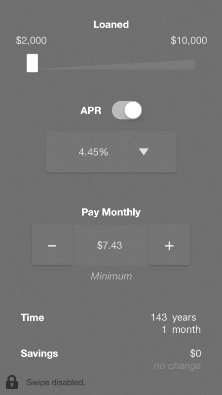
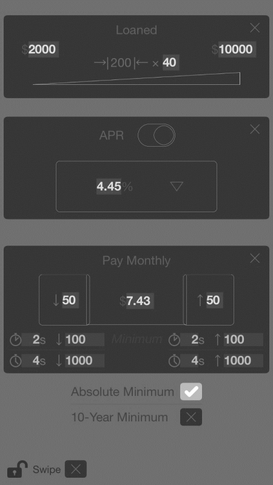
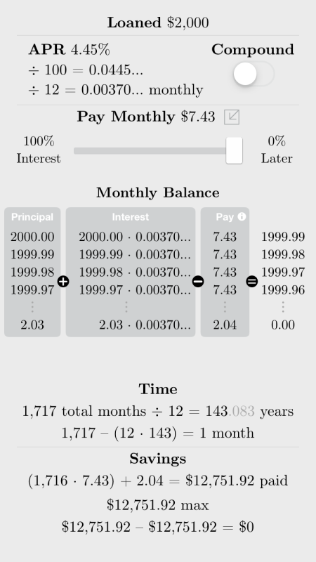

---
# for rendering with R
# title: "*✓ Student Loans*"
output: 
  word_document:
    pandoc_args: ["--lua-filter=gitlab-math.lua"]
---

<!--
  # for captions
  word_document:
  fig_caption: true

  # for reference document
  word_document:
    reference_docx: template.docx
-->

# iOS App Overview for Instructors’ Personal Reference

<!-- 
A caption will only show if its image is by itself on its own line.
Therefore, no captions will show if images are inline.

Alternative: construct a table with captions.
Problem is that tables need header rows, so use captions in the header.
-->

| Video Introduction | Main Screen | Main Screen\  (Editing Mode) | Mathematics Screen\  (Swipe Enabled) |
|:-:|:-:|:-:|:-:|
||||| <!-- empty line -->
|  |  |  |  |

Figure: Screenshots

Once the app loads, it plays a video that illustrates how one can
utilize the app. Close the video to access the main screen. In the main
screen, one can move the thumb of the Loaned slider, press on the thumb
of the APR switch, select a different percentage, or click on either the
minus or plus button. Whenever one does so, the Pay Monthly, Time,
Savings and change in Savings amounts are computed automatically. One
can reset the amounts by either pressing and holding the minus button
or–in editing mode–entering 0 for the Pay Monthly amount. Press on the
padlock icon to enter the editing mode. In editing mode, one can also
edit the slider, percentage, increment timers, and minimum payment; one
can enable the ability to swipe leftward, too. By default, the minimum
payment is the minimum for repaying student loans within ten years.

If swiping is enabled, one can swipe leftward–regardless if one is in
editing mode–to view how estimates were calculated (i.e., to access the
mathematics screen). In the mathematics screen, one can also examine how
Time and Savings amounts would vary, depending if interest was
compounded and on the percentage of interest one paid monthly. By
default, interest is not compounded and one pays 100% interest monthly.
Minimize the Pay Monthly amount, at any time, by pressing
. Swipe rightward to return to either the main
screen or main screen in editing mode. 4.45% is the Direct Loan rate for
July 1, 2017 to June 30, 2018. The current interest rate is 4.53%. The
app’s build is 2.7.3 (141), where “2.7.3 (141)” stands for major
version 2, minor version 7, revision 3 and build 141.